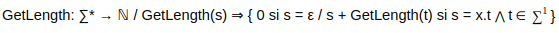
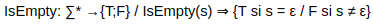
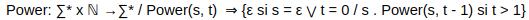

# Especificaciones matemáticas

1.  ## GetLength: Epsilon* -> N

- La función cuenta la cantidad de caracteres de la cadena que recibe.

2.  ## IsEmpty: Epsilon* -> {T,F}

- La función valida si la cadena que recibe es vacía. Esto quiere decir que, retornará un valor booleano dependiendo el valor de la cadena que ingrese.

3.  ## Power: Epsilon* x N -> Epsilon*

- La función toma una cadena y la multiplica por si misma las veces que el usuario lo indique.

4. ## AreEqual Epsilon* x Epsilon* -> {T; F}

- La función valida si dos cadenas ingresadas son idénticas. Retornará true, si son iguales, o false, si son diferentes.