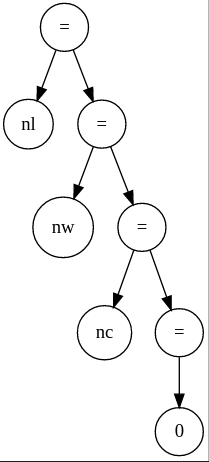
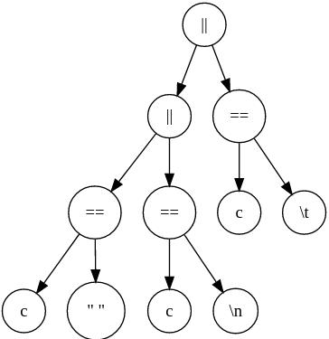
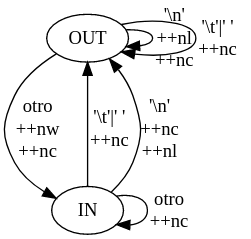

### Árboles de exoresión

1.b)

1.c)

2.a)

2.b)

A = (Q, ∑, T, q0, F)
- Donde:
    - Q = {IN, OUT}
    - ∑ = ASCII
    - q0 = OUT
    - F = {IN, OUT} = Q
    - T = {OUT si ∑ = {"","\n","\t"} / IN si ∑ != {"","\n","\t"}}

3.a.II)

Versión K&R

- Ventajas 
    - Utiliza un código más corto, por lo tanto más simple.
    - Utiliza #define para las variables de valores IN y OUT lo que facilita la interpretación del código. Utilizar #define permite definir constantes sibolicas de diferentes tipos.
    - Usamos solamente enteros, lo que simplifica la lógica del código.

- Desventajas
    - La variable simbolica puede adoptar diferentes enteros que no están declarados.

Versión Enum y Switch

- Ventajas
    - El uso del switch hace que el código se asemeje más al modelo de la maquina de estados.

- Desventajas
    - No se pueden definir enums con valores decimales ni cadenas, sólo valores enteros.

## Implementación de GOTO

¿Tiene alguna aplicación goto hoy en día? ¿Algún lenguaje moderno lo usa?

La instruccíon GOTO a lo largo de su historia siempre fue controversial. Esto se debe a que por su característica de indicar en donde debe continuar el programa, hace que se haga dificil el entendimiento y corrección del código en el que se usó. A su vez, se reconoce que la utilización del goto es favorable en ciertos casos.
De todas formas, su implementación hace que se reduzca la complejidad de ciertos algoritmos.
Dos de los lenguajes que utilizan goto son C# y Golang

## Implementación de funciones recursivas

¿Es necesario que las funciones accedan a contadores? Si es así, ¿cómo hacerlo?

En caso de que el programa deba acceder a contadores, los mecanismos para hacerlo son:

- Mecanismo de argumentos: los datos son suministrados a la función a través de un listado de argumentos. Dentro del contexto interno de la función, estos argumentos serán creados automáticamente al momento de invocar a la función pero es necesario proporcionarselos al momento de invocarla.

- Mecanismo de Variables Externas: los datos son alojados a variables globales externas a la función, esto significa que pueden ser accedidos por cualquier función. La función ya no recibe esos datos como parte de sus parámetros, pero igualmente los puede alcanzar y usar para ejecutar instrucciones con ellos.

## Benchmarks

